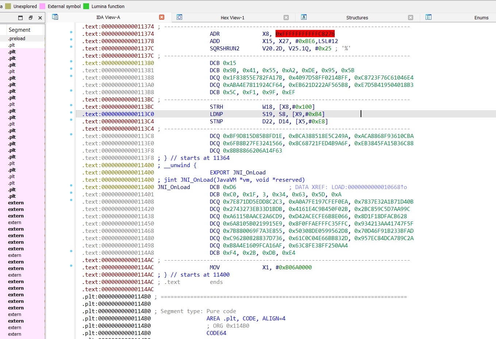

# Simple Android ELF Encryption Demo Project

This is a demo project demonstrating basic packing and self-decryption of Android dynamic libraries within Gradle plugin code and JNI C code. 

The encryption approach involves registering a task in the Gradle plugin code after the `stripDebugSymbols` step. This task uses the existing `net.fornwall:jelf` library to parse the ELF (the stripped `.so` library generated during project build) and then encrypts the `.text` section using the AES-CTR algorithm. At the start of the `.so` library execution, a new function must be created in the .init_array and placed in a section different from `.text`. This function uses the AES-CTR algorithm provided by the OpenSSL library to decrypt the encrypted `.text` content. During this process, the memory attributes must first be modified to writable (`rwxp`), then decrypted, and finally, the memory segment attributes must be restored to read-only (`r-xp`), while also flushing the CPU cache to prevent residual pre-encryption instructions.

As shown in the figure, this is the effect after encryption. Clearly, IDA Pro is no longer able to recognise the machine code as correct instructions, let alone convert assembly instructions to pseudo-code with a single press of F5.

After this basic encryption process, it can deter entry-level reverse engineers, but it is still not sufficiently secure, as it can be dumped and repaired in memory to obtain the original `.so` file. In such cases, consider adding anti-debugging mechanisms or more advanced encryption techniques.

One limitation of this project is that the code for decryption, cache flushing, and other operations must be openly placed in another `.so` dynamic library for the main `.so` to call. This is because these operations recursively depend on many OpenSSL library APIs and GCC inline functions. If statically linked into the main `.so`, they would all be linked into the .text code section, which remains encrypted at that stage. Direct invocation would trigger a SIGILL exception and lead to a crash.

The project code is rather disorganised, but it provides a basic concept for reference.